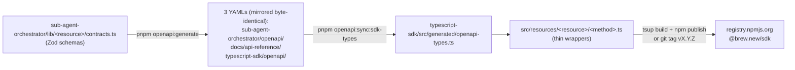

# Releasing `@brew.new/sdk`

The single concise reference for iterating on this SDK and shipping a new
version to npm. Read [`AGENTS.md`](./AGENTS.md) for code conventions and
[`docs/development.md`](./docs/development.md) for the deeper end-to-end
"add a new endpoint" walkthrough.

## Source of truth



The Zod contracts in `sub-agent-orchestrator/lib/<resource>/contracts.ts`
are the **only** source of truth. Everything downstream is generated.
Never hand-edit `openapi/public-api-v1.yaml` or
`src/generated/openapi-types.ts` — they get overwritten.

## Iterate loop

1. **Make the API change in the app package** (`sub-agent-orchestrator/`):
   - Update or add a Zod schema in `lib/<resource>/contracts.ts`.
   - Update or add the route handler under `app/api/v1/<resource>/route.ts`.
   - Register the operation in `openapi/public-api-v1-<resource>.ts`.
   - Add the app-side test in `tests/api/`.

2. **Mirror the spec to every consumer**, from inside `sub-agent-orchestrator/`:

   ```bash
   pnpm openapi:generate          # writes the YAML to all 3 locations
   pnpm openapi:sync:sdk-types    # regenerates src/generated/openapi-types.ts
   pnpm openapi:check             # CI-style verification that everything is in sync
   ```

3. **Update the SDK** (this package):
   - One file per method under `src/resources/<resource>/<method>.ts`.
   - Wire it into `src/resources/<resource>/resource.ts`.
   - Re-export public types from `src/index.ts`.
   - Add an MSW test under `tests/resources/<resource>/<method>.test.ts`.

4. **Document it** in `docs/<resource>.md` (the resource-level reference)
   and update `RELEASING.md` (this file) only if the workflow itself changes.

## Local validation (run before every commit)

```bash
bun install --frozen-lockfile  # only if package.json or bun.lock changed
bun tsc                        # typecheck (strict, exactOptionalPropertyTypes)
bun lint                       # eslint flat config + typescript-eslint
bun run format                 # prettier write (or `format:check` to verify)
bun run test                   # vitest + MSW. NEVER `bun test` (bypasses MSW)
bun run build                  # tsup -> dist/ esm + cjs + .d.ts + .d.cts
```

CI (`.github/workflows/ci.yml`) runs the same checks plus a
`git diff --exit-code src/generated/openapi-types.ts` guard, so any drift
between `openapi/public-api-v1.yaml` and the generated types fails the
build.

## Release recipe (preferred path: tag-driven)

After [`.github/workflows/release.yml`](./.github/workflows/release.yml)
is wired up with the `NPM_TOKEN` secret (one-time setup, see below),
shipping a new version is just:

```bash
# from typescript-sdk/, on a clean main, after iterate loop is done
npm version <patch|minor|major|x.y.z> --no-git-tag-version
git add package.json && git commit -m "Release vX.Y.Z"
git push origin main
git tag vX.Y.Z
git push origin vX.Y.Z          # <-- this triggers the workflow
```

The workflow then:

1. Asserts `package.json#version` matches the tag (no silent drift).
2. Runs the full validation pipeline (tsc + lint + format:check + test +
   build + generated-types freshness).
3. `npm publish --provenance --access public` so the npmjs.com listing
   shows the verified provenance badge linking back to the workflow run.
4. Creates a GitHub Release page with auto-generated notes from the
   commits since the previous tag.

`SDK_VERSION` is build-time-derived from `package.json` via the
`__SDK_VERSION__` define in [`tsup.config.ts`](./tsup.config.ts), so
`npm version` is the only edit needed for the user-visible version.

## Release recipe (fallback: manual publish)

Only use this if the GitHub Action is unavailable. From `typescript-sdk/`:

```bash
npm version <bump> --no-git-tag-version
npm publish --dry-run                     # smoke check (runs prepublishOnly)
npm publish                               # prompts for OTP if 2FA on
git add package.json && git commit -m "Release vX.Y.Z"
git push origin main && git tag vX.Y.Z && git push origin vX.Y.Z
```

`prepublishOnly` (in `package.json`) runs the validation pipeline before
`npm publish` uploads anything, so a broken tarball cannot ship. **Use
`npm publish`, not `bun publish`** — Bun's publish skips lifecycle
scripts, including `prepublishOnly`.

## Version policy

Pre-1.0 history shipped breaking changes as minor bumps. From 1.0
onward, follow standard SemVer:

| Change | Bump |
|---|---|
| Adding a new method, type, or optional input field | `minor` |
| Bug fix, doc-only change, internal refactor with same public surface | `patch` |
| Removing or renaming any public export, changing a method signature, removing an enum value | `major` |
| Pre-release for risky changes | `1.x.0-alpha.0` published with `--tag alpha` |

Once a version is published it is immutable. If something is broken
after publish, ship `X.Y.Z+1` rather than try to fix in place.
`npm unpublish` is only available for 72 hours and `npm deprecate` is
the long-term knob.

## One-time setup

### npm Automation token (for the GitHub Action)

1. Create an Automation token at
   [npmjs.com/settings/&lt;user&gt;/tokens](https://www.npmjs.com/settings/thomas-brew/tokens) →
   "Generate New Token" → **Automation** (bypasses 2FA so CI never
   gets stuck on an OTP prompt). Scope: at minimum the `@brew.new`
   org with publish access.
2. Add it as a repository secret:
   [github.com/GetBrew/typescript-sdk/settings/secrets/actions](https://github.com/GetBrew/typescript-sdk/settings/secrets/actions) →
   "New repository secret" → name `NPM_TOKEN`, value the new token.
3. Sanity check: push any tag matching `v*.*.*` (e.g. retag the current
   release as `v1.0.0-test` on a fork) and confirm the workflow runs
   green up to the publish step.

### Local maintainer auth (for the manual fallback)

1. Generate a **Publish** token (separate from the CI Automation token)
   at the same npm tokens page.
2. Store it locally:
   ```bash
   npm config set //registry.npmjs.org/:_authToken=npm_xxx
   ```
3. Verify: `npm whoami` should print your username; `npm access list packages @brew.new` should show `@brew.new/sdk: read-write`.

### Token rotation

If a token is ever exposed (chat, screenshot, log file, repo by
accident), rotate immediately:

1. Revoke at [npmjs.com/settings/&lt;user&gt;/tokens](https://www.npmjs.com/settings/thomas-brew/tokens).
2. Generate a fresh one of the same type (Automation or Publish).
3. Update the consumer (GitHub secret or local `~/.npmrc`).

## Common gotchas

- **`bun test` ≠ `bun run test`.** The first invokes Bun's built-in
  runner which ignores `vitest.config.ts` and `tests/setup.ts`. MSW
  never starts and every HTTP test silently passes. Always use
  `bun run test`.
- **`bun publish` skips `prepublishOnly`.** Use `npm publish` so the
  validation pipeline runs.
- **OpenAPI YAML lives in three places.** Never hand-edit any of them.
  `pnpm openapi:generate` rewrites all three from the Zod source.
- **`SDK_VERSION` is auto-injected.** Bumping `package.json#version` is
  the only edit. The `0.0.0-dev` you see in source is the dev fallback
  — it's replaced at build time.
- **Provenance requires `id-token: write`.** Already set in
  `release.yml`; if you fork the workflow elsewhere, remember to
  preserve that permission.
- **`@brew.new/sdk` is a scoped package.** First publish required
  `--access public`; this is now pinned via `publishConfig` in
  `package.json` and inherited automatically.

## Useful URLs

- npm package page: <https://www.npmjs.com/package/@brew.new/sdk>
- GitHub repo: <https://github.com/GetBrew/typescript-sdk>
- Public API docs (Mintlify): <https://docs.getbrew.io>
- App package (where the OpenAPI source lives): `sub-agent-orchestrator/`
